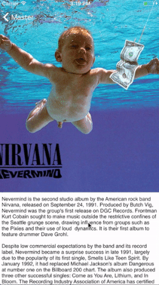
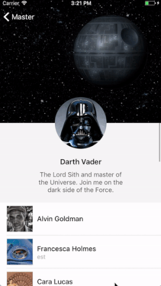

# Autolayout Tips'n'Tricks

Here you can find app with 3 examples of using Cocoa Autolayout in non-trivial cases. Maybe you already know about them or how to do it, but if you are just trying to master Autolayout technics it might be helpful.

I collected 3 real-life-app use cases, which you can find in every third app.

  

### Onboarding

Really typical onboarding experience.
From Autolayout perspective it demonstrates how to you implement such things as conditionally floating views.

### Sticky Image

Such kind of UI could be used as details views of some post from Social Networks. Here you can find example of using autolayout inside UIScrollView and particularly hot to implement sticky-rubber behavior.

### Sticky Table Header.

It's really popular UI for profile like views. The same behavior as in previous example but implement inside UITableView and specifically inside table header view. The trickiest part is that table header should be sized before setting to UITableView and if have some dynamic-size content under sticky image you should have ability to calculate the size of header in initial state.

---

You are free to write me directly or create issues with your questions. I will try to help you with you case.

Twitter: [yariksmirnov](https://twitter.com/yariksmirnov)

Remember - many developers underestimate abilities which Autolayout gives us. With such powerful tool you can create really complex behaviors with just few lines of code instead o dozens calculations inside `scrollViewDidScroll`
